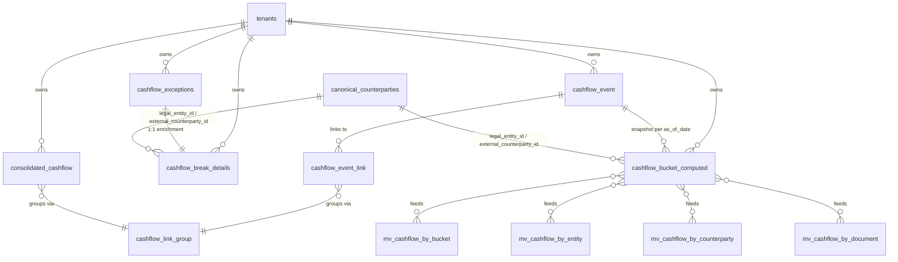

# Cashflows Drill-Down Schema

Server-side aggregation infrastructure for the Cashflows module drill-down.
Replaces the client-side bucket math previously done in `useCashflows.ts`.

## ER Diagram



## as_of_date snapshot semantics

`cashflow_bucket_computed` is a **point-in-time snapshot** of how each cashflow
event was bucketed (`OVERDUE`, `D30`, `D45`, `D60`, `D90`, `D120`, `BEYOND_120`,
`PAID_RECEIVED`, `CANCELLED`) on a given date.

* The daily cron job `run_cashflow_daily_drill_refresh()` runs at **02:00 UTC**
  and rebuilds the snapshot for `current_date`, then refreshes all four MVs.
* Each row is keyed `(cashflow_event_id, as_of_date)` so historical
  drill-downs always reflect the bucket as it was *on that day* — even after
  a payment is later received.
* All MVs (`mv_cashflow_by_bucket`, `mv_cashflow_by_entity`,
  `mv_cashflow_by_counterparty`, `mv_cashflow_by_document`) carry
  `as_of_date` in their grouping key so consumers can pin a date.

## Access pattern

| Object | Direct read? | How to query |
|---|---|---|
| `cashflow_break_details` | ✅ via RLS (tenant-scoped) | `from('cashflow_break_details').select(...)` |
| `cashflow_bucket_computed` | ✅ read-only via RLS | `from('cashflow_bucket_computed').select(...)` |
| `mv_cashflow_by_*` | ❌ revoked from authenticated/anon | Call accessor RPCs |
| Accessor RPCs | ✅ `SECURITY INVOKER`, tenant-scoped | `rpc('get_mv_cashflow_by_bucket', { _as_of_date })` |

## Write permissions on `cashflow_break_details`

| Role | INSERT | UPDATE | DELETE |
|---|---|---|---|
| `admin` | ✅ | ✅ | ✅ |
| `controller` | ✅ | ✅ | ✅ |
| `treasury_analyst` | ✅ | ✅ | ❌ |
| All other authenticated users | ❌ | ❌ | ❌ |

## Cron scheduling

`pg_cron` and `pg_net` are enabled. Schedule the daily refresh **outside this
migration** (it requires the project URL + anon key, which are tenant-specific):

```sql
SELECT cron.schedule(
  'cashflow-daily-drill-refresh',
  '0 2 * * *',
  $$ SELECT public.run_cashflow_daily_drill_refresh(); $$
);
```

If `pg_cron` is unavailable in your environment, invoke
`run_cashflow_daily_drill_refresh()` from an external scheduler
(GitHub Actions, Cloud Scheduler, etc.) hitting an Edge Function.

## Demo / test seeding

```sql
SELECT public.seed_cashflow_break_details_for_run('<tenant-uuid>');
```

Creates one `cashflow_break_details` row per existing `cashflow_exceptions`
row (idempotent via the unique constraint on `cashflow_exception_id`).
